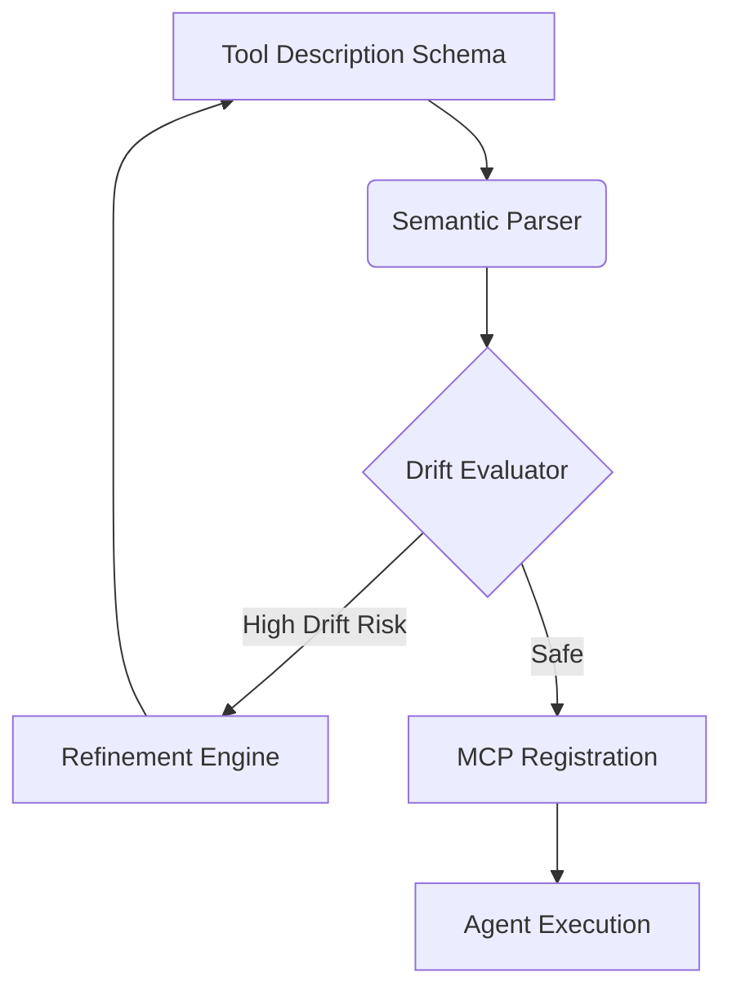

# SemanticDrift

<div align="center">
  <h3>Semantic Drift</h3>
  <p>A novel reliability challenge in Model Context Protocol (MCP) tool descriptions for Agentic AI systems.</p>
</div>

<p align="center">
  <a href="https://github.com/Mukkandi-Sridhar/SemanticDrift/blob/main/LICENSE">
    
  </a>
  <a href="https://github.com/Mukkandi-Sridhar/SemanticDrift/commits/main">
    
  </a>
  <a href="https://github.com/Mukkandi-Sridhar/SemanticDrift">
    
  </a>
  <a href="https://github.com/Mukkandi-Sridhar/SemanticDrift/stargazers">
    
  </a>
  <a href="https://github.com/Mukkandi-Sridhar/SemanticDrift/issues">
    
  </a>
</p>

> **Status:** Research Proposal & Pilot Study. This repository contains the first public release of the SemanticDrift research proposal and pilot study. The full implementation, empirical evaluation, datasets, and benchmark results will be released in future versions.

## Abstract
As Agentic AI systems increasingly rely on the Model Context Protocol (MCP) for tool invocation, the semantic alignment between tool descriptions and model interpretation becomes critical. We introduce "Semantic Drift," a phenomenon where an LLM's understanding of a tool's purpose diverges from the developer's intent due to contextual variations, prompting nuances, or descriptive ambiguity. This research proposes a framework to quantify and mitigate Semantic Drift, ensuring robust tool execution in complex agentic workflows.

## Motivation
With the advent of autonomous agents, tools are documented via natural language schemas (e.g., OpenAPI, JSON schemas). However, natural language is inherently ambiguous. A tool described as "fetches user data" might be invoked by an LLM for authentication, retrieval, or profiling. This misalignment causes unexpected behaviors, system failures, and security vulnerabilities.

## Research Problem
How can we formally define, measure, and mitigate Semantic Drift in tool descriptions provided to Large Language Models?

## Proposed Solution
We propose a novel evaluation framework and taxonomy for Semantic Drift. The solution involves:
1. **Taxonomy:** Categorizing types of drift (e.g., Over-generalization, Over-specialization, Contextual Misalignment).
2. **Measurement:** A benchmark dataset designed to evaluate LLMs on tool selection accuracy under ambiguous conditions.
3. **Mitigation Pipeline:** An automated pipeline for refining tool descriptions and enforcing semantic strictness during MCP configuration.

## Key Contributions
* Definition and formalization of "Semantic Drift" in Agentic AI.
* A comprehensive taxonomy of tool description failure modes.
* An empirical pilot study evaluating leading LLMs on tool selection drift.
* Open-source tools for semantic validation of MCP schemas.

## Semantic Drift Taxonomy

| Drift Type | Description | Example Consequence |
| :--- | :--- | :--- |
| **Over-generalization** | LLM applies a specific tool to a broad, unintended set of tasks. | Using `get_user_email` to find any user's contact info. |
| **Over-specialization** | LLM fails to recognize a tool's applicability to a broader task. | Missing that `search_docs` can also search code snippets. |
| **Contextual Misalignment** | Tool interpretation shifts based on surrounding conversation context. | Using `delete_file` for "cleaning up" memory. |
| **Parameter Hallucination** | LLM infers parameters not present in the tool schema. | Passing `force=True` to a read-only tool. |

## SemanticDrift Pipeline Overview



## Planned Evaluation
The upcoming empirical study will evaluate GPT-4, Claude 3.5 Sonnet, and Gemini 1.5 Pro on our custom benchmark dataset, measuring Drift Rate (DR) and Tool Selection Accuracy (TSA) across varying levels of description ambiguity.

## Repository Structure

```text
SemanticDrift/
├── paper/           # Research paper (PDF/Word format)
├── figures/         # Generated diagrams and plots
├── assets/          # Static assets for documentation
├── future-code/     # Placeholder for upcoming implementation
├── datasets/        # Benchmark datasets for tool descriptions
├── docs/            # Detailed documentation
└── examples/        # Examples of Semantic Drift
```

## Paper
- [SemanticDrift.pdf (Direct Link)](paper/SemanticDrift.pdf)
- [SemanticDrift.docx (Word Source)](paper/SemanticDrift.docx)

## Citation
If you find this research helpful, please cite us:

```bibtex
@techreport{sridhar2026semanticdrift,
  title={Semantic Drift: A Novel Reliability Challenge in MCP Tool Descriptions},
  author={Sridhar, Mukkandi},
  institution={Rajeev Gandhi Memorial College of Engineering and Technology},
  year={2026},
  url={https://github.com/Mukkandi-Sridhar/SemanticDrift}
}
```

## Future Work
- Release of the `DriftBench` dataset.
- Open-sourcing the MCP semantic validation library.
- Comprehensive empirical study across open-source and proprietary LLMs.

## Roadmap
- [x] Phase 1: Research Proposal and Pilot Study.
- [ ] Phase 2: Benchmark Dataset Construction (Expected Q3).
- [ ] Phase 3: Empirical Evaluation and Framework Release.

## Contributing
We welcome contributions! Please see [CONTRIBUTING.md](CONTRIBUTING.md) for details on how to get involved.

## License
This project is licensed under the Creative Commons Attribution 4.0 International License - see the [LICENSE](LICENSE) file for details.

## Contact
**Mukkandi Sridhar**
* Affiliation: Department of Artificial Intelligence, Rajeev Gandhi Memorial College of Engineering and Technology, Nandyal, Andhra Pradesh, India
* Email: [sridharraoyalls@gmail.com](mailto:sridharraoyalls@gmail.com)
* GitHub: [@Mukkandi-Sridhar](https://github.com/Mukkandi-Sridhar)
* LinkedIn: [Sridhar M](https://linkedin.com/in/sridhar-m-a40663331)
